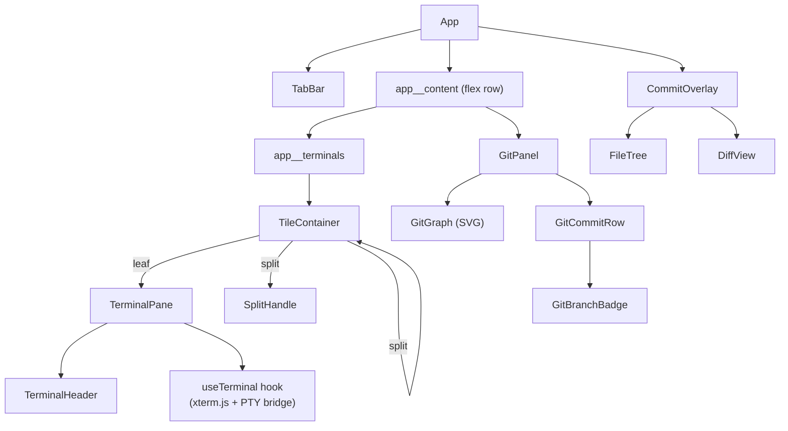
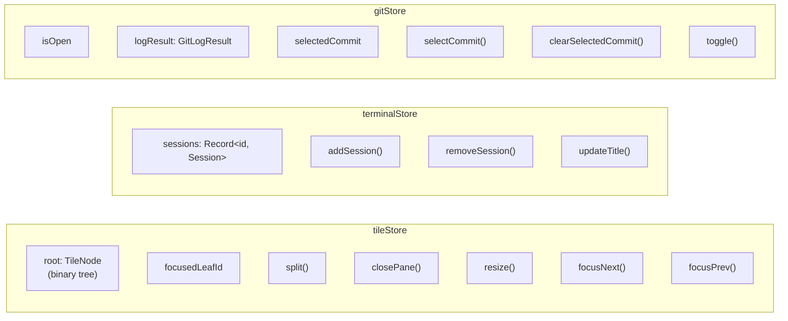
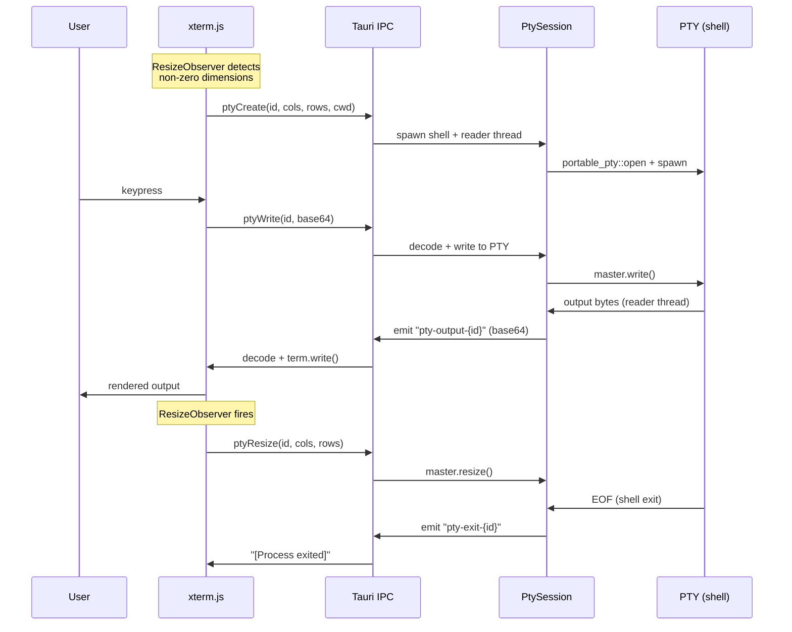
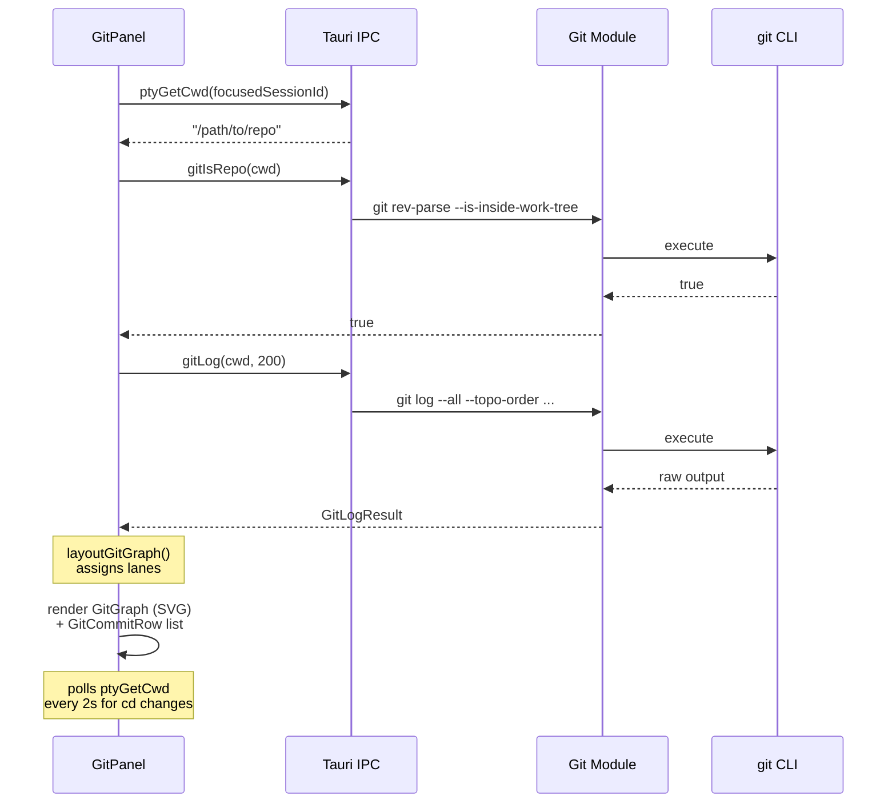
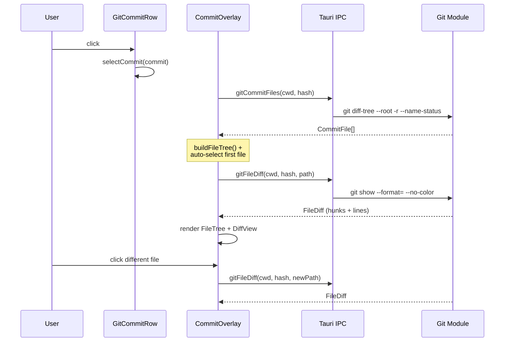

# Terminal Plus — Architecture

## High-Level Overview

```
+---------------------------------------------------------------+
|                        Tauri Window                            |
|  (decorations: false, transparent: true, macOSPrivateApi)      |
+---------------------------------------------------------------+
|                                                                |
|   React Frontend (Vite + TypeScript)                           |
|   +----------------------------------------------------------+ |
|   |  TabBar  (drag region + traffic lights + tabs + actions)  | |
|   +----------------------------------------------------------+ |
|   |                        |                                  | |
|   |   TileContainer        |   GitPanel (toggleable)          | |
|   |   (recursive binary    |   +-------------------------+   | |
|   |    tree layout)        |   | GitGraph (SVG)          |   | |
|   |                        |   | GitCommitRow[]          |   | |
|   |   +------+ +------+   |   |   GitBranchBadge[]      |   | |
|   |   |Term 1| |Term 2|   |   +-------------------------+   | |
|   |   |Pane  | |Pane  |   |                                  | |
|   |   +------+ +------+   |                                  | |
|   |   SplitHandle (drag)   |                                  | |
|   +------------------------+----------------------------------+ |
|                                                                |
|   CommitOverlay (modal, z-index 1000)                          |
|   +----------------------------------------------------------+ |
|   | FileTree (left)  |  DiffView (right, unified diff)       | |
|   +----------------------------------------------------------+ |
|                                                                |
+---------------------------------------------------------------+
        |                                          |
        | Tauri IPC (invoke)                       | Tauri Events
        | Tauri Events (listen)                    | (emit)
        |                                          |
+---------------------------------------------------------------+
|                                                                |
|   Rust Backend (Tauri 2 + portable_pty)                        |
|   +------------------------+  +-----------------------------+  |
|   | PtyManager             |  | Git Module                  |  |
|   |  HashMap<id, Session>  |  |  git log --all --topo-order |  |
|   |                        |  |  git diff-tree              |  |
|   | PtySession             |  |  git show (unified diff)    |  |
|   |  portable_pty spawn    |  |  git rev-parse              |  |
|   |  reader thread (I/O)   |  +-----------------------------+  |
|   |  shell integration     |                                   |
|   +------------------------+                                   |
|        |                                                       |
+--------|-------------------------------------------------------+
         |
    +---------+
    |   PTY   |  (zsh/bash with shell integration)
    +---------+
```

## Project Structure

```
terminal-plus/
├── package.json
├── vite.config.ts
├── tsconfig.json
├── index.html
│
├── src/                                    # React Frontend
│   ├── main.tsx                            # Entry point
│   ├── App.tsx                             # Root: keybindings + layout
│   ├── App.css
│   │
│   ├── components/
│   │   ├── layout/
│   │   │   ├── TileContainer.tsx           # Recursive tile renderer
│   │   │   ├── SplitHandle.tsx             # Draggable resize divider
│   │   │   └── TabBar.tsx                  # Window controls + tabs
│   │   ├── terminal/
│   │   │   ├── TerminalPane.tsx            # Terminal wrapper
│   │   │   ├── TerminalHeader.tsx          # Per-pane title bar
│   │   │   └── useTerminal.ts              # xterm.js + PTY bridge
│   │   └── git/
│   │       ├── GitPanel.tsx                # Sidebar panel
│   │       ├── GitGraph.tsx                # SVG branch graph
│   │       ├── GitCommitRow.tsx            # Clickable commit row
│   │       ├── GitBranchBadge.tsx          # Branch/tag badge
│   │       ├── CommitOverlay.tsx           # Commit detail modal
│   │       ├── FileTree.tsx                # Hierarchical file browser
│   │       └── DiffView.tsx                # Unified diff renderer
│   │
│   ├── stores/
│   │   ├── tileStore.ts                    # Tile tree state (Zustand)
│   │   ├── terminalStore.ts                # Session registry
│   │   └── gitStore.ts                     # Git panel state
│   │
│   ├── lib/
│   │   ├── ipc.ts                          # Typed Tauri IPC wrappers
│   │   ├── tileTree.ts                     # Pure tree algorithms
│   │   ├── keybindings.ts                  # Keyboard shortcut system
│   │   └── gitGraphLayout.ts               # Lane assignment algorithm
│   │
│   ├── types/
│   │   ├── tile.ts                         # TileNode, TileSplit, TileLeaf
│   │   ├── terminal.ts                     # TerminalSession
│   │   └── git.ts                          # GitCommit, FileDiff, etc.
│   │
│   └── styles/
│       ├── variables.css                   # Midnight Indigo theme
│       ├── terminal.css                    # Terminal pane styles
│       ├── tiling.css                      # Tile layout + tab bar
│       └── git-panel.css                   # Git panel + overlay + diff
│
└── src-tauri/                              # Rust Backend
    ├── Cargo.toml
    ├── tauri.conf.json
    ├── capabilities/default.json
    └── src/
        ├── main.rs                         # Entry point
        ├── lib.rs                          # Tauri builder + command registry
        ├── pty/
        │   ├── mod.rs
        │   ├── session.rs                  # PtySession: spawn, I/O, cwd
        │   ├── manager.rs                  # PtyManager: session HashMap
        │   ├── commands.rs                 # 5 Tauri commands (pty_*)
        │   ├── shell_integration.zsh       # Zsh prompt + colors
        │   └── shell_integration.bash      # Bash prompt + colors
        └── git/
            ├── mod.rs
            ├── types.rs                    # GitCommit, DiffHunk, etc.
            ├── log.rs                      # git log parser
            ├── diff.rs                     # git diff/show parser
            └── commands.rs                 # 4 Tauri commands (git_*)
```

## Component Tree



## State Management (Zustand)



## Tile Tree (Binary Tree Layout)

```
Example: 3 panes (one horizontal split, then a vertical split on the right)

           TileSplit (horizontal, 0.5)
           /                         \
     TileLeaf                   TileSplit (vertical, 0.5)
     sessionId: "abc"           /                        \
                          TileLeaf                  TileLeaf
                          sessionId: "def"          sessionId: "ghi"

Renders as:
+---------------------------+---------------------------+
|                           |          Term 2           |
|          Term 1           +---------------------------+
|                           |          Term 3           |
+---------------------------+---------------------------+
```

Pure functions in `tileTree.ts`:
- `splitNode(root, leafId, direction, sessionId)` — replace leaf with split
- `removeNode(root, leafId)` — remove leaf, promote sibling
- `resizeSplit(root, splitId, ratio)` — update split ratio (0.1–0.9)
- `collectLeaves(node)` — flatten to leaf array
- `getAdjacentLeaf(root, leafId, "next"|"prev")` — circular focus navigation

## Data Flow

### Terminal I/O



### Git Panel



### Commit Overlay



## Tauri IPC Commands

| Command | Module | Arguments | Returns |
|---------|--------|-----------|---------|
| `pty_create` | pty | sessionId, cols, rows, cwd? | `()` |
| `pty_write` | pty | sessionId, data (base64) | `()` |
| `pty_resize` | pty | sessionId, cols, rows | `()` |
| `pty_destroy` | pty | sessionId | `()` |
| `pty_get_cwd` | pty | sessionId | `String` |
| `git_log` | git | cwd, maxCount? | `GitLogResult` |
| `git_is_repo` | git | cwd | `bool` |
| `git_commit_files` | git | cwd, hash | `Vec<CommitFile>` |
| `git_file_diff` | git | cwd, hash, path | `FileDiff` |

## Tauri Events

| Event | Direction | Payload | Purpose |
|-------|-----------|---------|---------|
| `pty-output-{id}` | Rust → Frontend | `String` (base64) | Terminal output stream |
| `pty-exit-{id}` | Rust → Frontend | `void` | Shell process exited |

## Keyboard Shortcuts

| Shortcut | Action |
|----------|--------|
| `Cmd+D` | Split horizontal |
| `Cmd+Shift+D` | Split vertical |
| `Cmd+Shift+W` | Close pane |
| `Cmd+Shift+]` | Focus next pane |
| `Cmd+Shift+[` | Focus previous pane |
| `Cmd+Shift+G` | Toggle git panel |

Registered on `window` in capture phase to intercept before xterm.js.

## PTY Session Lifecycle

```
Mount TerminalPane
  → useTerminal hook
    → ResizeObserver waits for non-zero dimensions
      → ptyCreate(sessionId, cols, rows, cwd)
        → Rust: PtySession::spawn()
          → portable_pty opens PTY pair
          → spawns shell (zsh -l) with ZDOTDIR shell integration
          → spawns dedicated reader thread (blocking I/O)
          → registers in PtyManager HashMap

Session survives React remounts (module-level activePtys Set)

Explicit close only:
  closePane() → destroyPtySession(sessionId)
    → ptyDestroy(sessionId)
      → Rust: removes from PtyManager, drops session
```

## Shell Integration

```
Zsh:
  ZDOTDIR → ~/.terminal-plus/shell/zsh/
    .zshenv   → sources user's .zshenv
    .zprofile → sources user's .zprofile
    .zshrc    → sources user's .zshrc, then appends:
                - custom prompt (user path (git-branch) \n ❯)
                - LSCOLORS / LS_COLORS
                - zsh-syntax-highlighting (auto-detected)
                - zsh-autosuggestions (auto-detected)
    .zlogin   → sources user's .zlogin

Bash:
  BASH_ENV → ~/.terminal-plus/shell/bash/.bashrc
    - sources user's .bash_profile + .bashrc
    - custom PS1 prompt with git branch
    - color environment variables
```

## Git Graph Layout Algorithm

```
Input:  GitCommit[]  (topo-ordered from git log)
Output: GitGraphCommit[]  (each commit gets lane + parentLanes)

Algorithm (gitGraphLayout.ts):
  1. Track active lanes (columns occupied by branches)
  2. For each commit:
     a. If commit hash is reserved in a lane → use that lane
     b. Otherwise → assign next free lane
  3. For each parent:
     a. First parent inherits the commit's lane
     b. Other parents get new lanes or reuse freed ones
  4. Record parentLanes for drawing connections

SVG rendering (GitGraph.tsx):
  - Circle at (lane * spacing, row * rowHeight) per commit
  - Straight lines for same-lane connections
  - Bezier curves for cross-lane merges
  - 8 lane colors cycling
```

## Theme

Midnight Indigo palette with 20% window transparency:

| Variable | Value | Usage |
|----------|-------|-------|
| `--bg-primary` | `rgba(10, 8, 36, 0.80)` | Terminal background |
| `--bg-secondary` | `rgba(16, 13, 56, 0.85)` | Panels, tab bar |
| `--bg-elevated` | `rgba(26, 22, 78, 0.85)` | Hover states |
| `--accent-blue` | `#3318E8` | Electric blue accent |
| `--accent-purple` | `#8B7DFF` | Hashes, hunk headers |
| `--accent-mint` | `#C8F5DC` | Mint green (added lines) |
| `--accent-red` | `#FF6B8A` | Removed lines, errors |
| `--fg-primary` | `#E8E6F0` | Primary text |

Window: `transparent: true`, `macOSPrivateApi: true`, `decorations: false` (custom traffic lights in TabBar).
