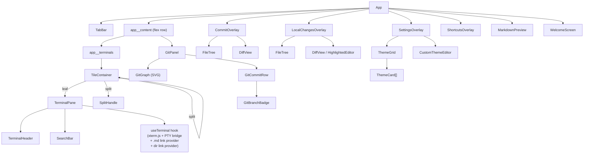
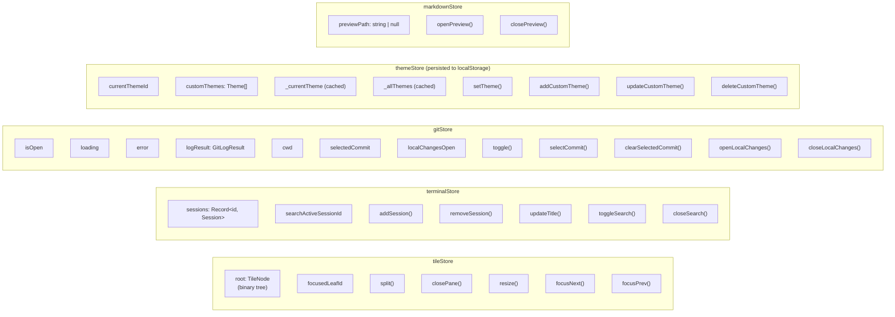
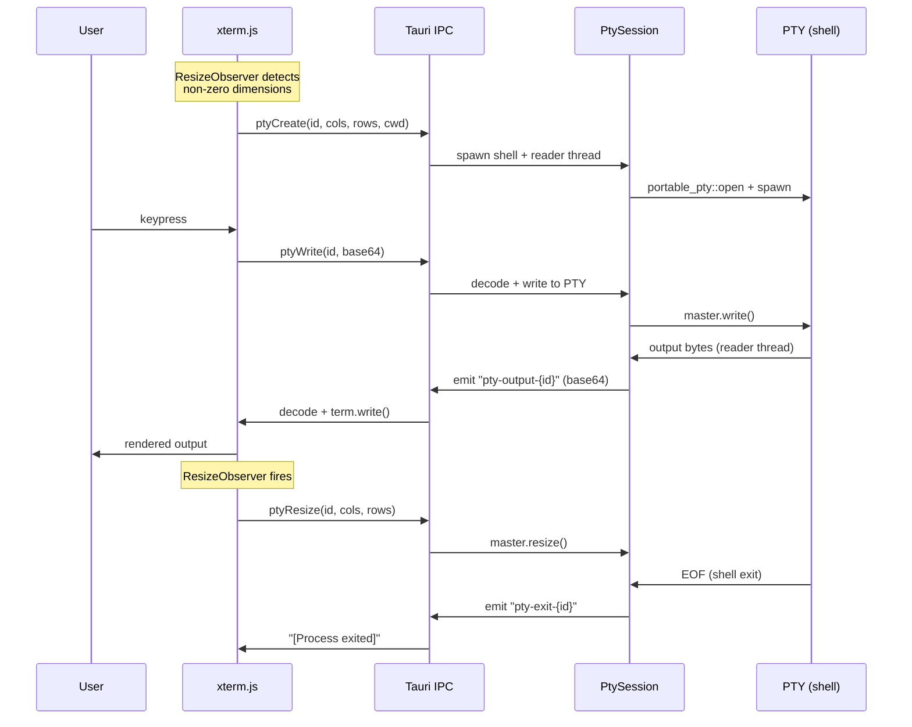
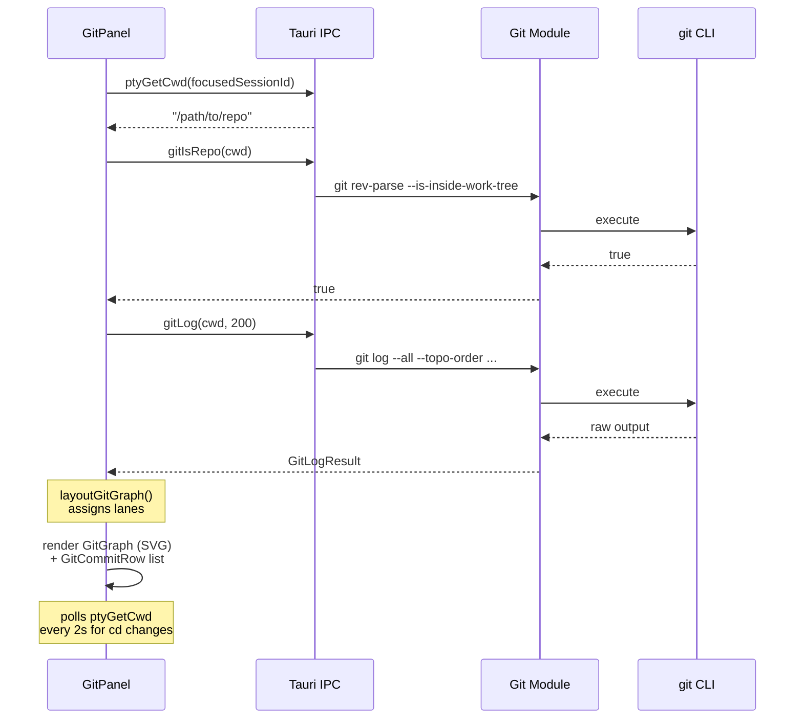
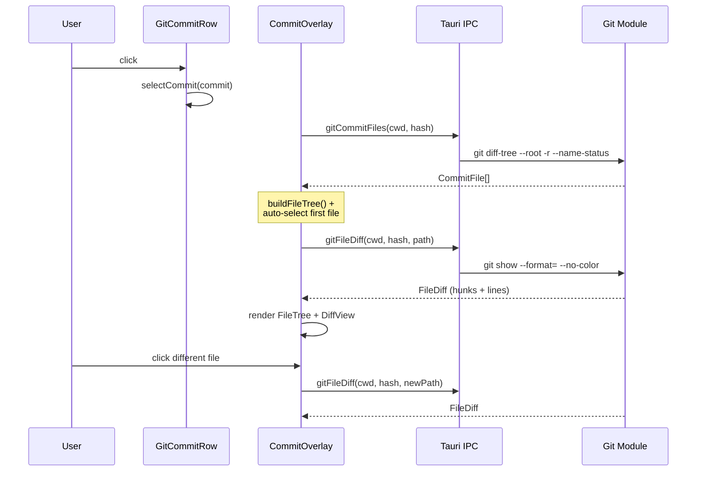
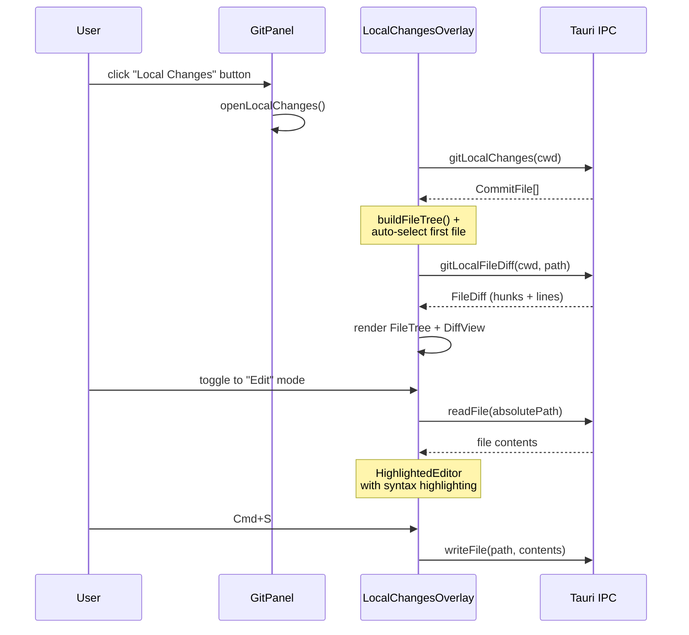
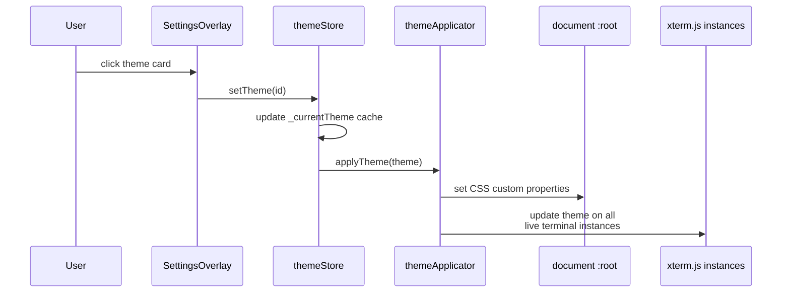

# Terminal Plus — Architecture

## High-Level Overview

```
+---------------------------------------------------------------+
|                        Tauri Window                            |
|  (decorations: false, transparent: true, macOSPrivateApi)      |
+---------------------------------------------------------------+
|                                                                |
|   React Frontend (Vite + TypeScript)                           |
|   +----------------------------------------------------------+ |
|   |  TabBar  (drag region + traffic lights + tabs + actions)  | |
|   +----------------------------------------------------------+ |
|   |                        |                                  | |
|   |   TileContainer        |   GitPanel (toggleable)          | |
|   |   (recursive binary    |   +-------------------------+   | |
|   |    tree layout)        |   | GitGraph (SVG)          |   | |
|   |                        |   | GitCommitRow[]          |   | |
|   |   +------+ +------+   |   |   GitBranchBadge[]      |   | |
|   |   |Term 1| |Term 2|   |   +-------------------------+   | |
|   |   |Pane  | |Pane  |   |                                  | |
|   |   |Search| |      |   |                                  | |
|   |   +------+ +------+   |                                  | |
|   |   SplitHandle (drag)   |                                  | |
|   +------------------------+----------------------------------+ |
|                                                                |
|   Overlays (portals on document.body, z-index 1000):           |
|   - CommitOverlay       (commit detail: file tree + diff)      |
|   - LocalChangesOverlay (working tree: file tree + diff/edit)  |
|   - SettingsOverlay     (theme grid + custom theme editor)     |
|   - ShortcutsOverlay    (keyboard shortcut reference)          |
|   - MarkdownPreview     (rendered markdown with edit mode)     |
|   - WelcomeScreen       (ASCII art splash, auto-fades)         |
|                                                                |
+---------------------------------------------------------------+
        |                                          |
        | Tauri IPC (invoke)                       | Tauri Events
        | Tauri Events (listen)                    | (emit)
        |                                          |
+---------------------------------------------------------------+
|                                                                |
|   Rust Backend (Tauri 2 + portable_pty)                        |
|   +------------------------+  +-----------------------------+  |
|   | PtyManager             |  | Git Module                  |  |
|   |  HashMap<id, Session>  |  |  git log --all --topo-order |  |
|   |                        |  |  git diff-tree              |  |
|   | PtySession             |  |  git show (unified diff)    |  |
|   |  portable_pty spawn    |  |  git rev-parse              |  |
|   |  reader thread (I/O)   |  |  working tree diff          |  |
|   |  shell integration     |  +-----------------------------+  |
|   +------------------------+                                   |
|   +-------------------------------+                            |
|   | Filesystem Commands           |                            |
|   |  read_file / write_file       |                            |
|   |  list_dir                     |                            |
|   +-------------------------------+                            |
|        |                                                       |
+--------|-------------------------------------------------------+
         |
    +---------+
    |   PTY   |  (zsh/bash with shell integration)
    +---------+
```

## Project Structure

```
terminal-plus/
├── package.json
├── vite.config.ts
├── tsconfig.json
├── index.html
│
├── src/                                    # React Frontend
│   ├── main.tsx                            # Entry point
│   ├── App.tsx                             # Root: keybindings + layout
│   ├── App.css
│   │
│   ├── components/
│   │   ├── layout/
│   │   │   ├── TileContainer.tsx           # Recursive tile renderer
│   │   │   ├── SplitHandle.tsx             # Draggable resize divider
│   │   │   └── TabBar.tsx                  # Window controls + tabs + action buttons
│   │   ├── terminal/
│   │   │   ├── TerminalPane.tsx            # Terminal wrapper (header + body + search)
│   │   │   ├── TerminalHeader.tsx          # Per-pane title bar + close button
│   │   │   ├── SearchBar.tsx              # In-pane search (regex, case-sensitive, match count)
│   │   │   └── useTerminal.ts              # xterm.js + PTY bridge + link providers
│   │   ├── git/
│   │   │   ├── GitPanel.tsx                # Sidebar panel (search, refresh, commit list)
│   │   │   ├── GitGraph.tsx                # SVG branch graph
│   │   │   ├── GitCommitRow.tsx            # Clickable commit row
│   │   │   ├── GitBranchBadge.tsx          # Branch/tag badge
│   │   │   ├── CommitOverlay.tsx           # Commit detail modal (file tree + diff)
│   │   │   ├── LocalChangesOverlay.tsx     # Working tree changes (diff + inline editor)
│   │   │   ├── FileTree.tsx                # Hierarchical file browser
│   │   │   └── DiffView.tsx                # Unified diff renderer
│   │   ├── settings/
│   │   │   ├── SettingsOverlay.tsx          # Theme picker modal
│   │   │   ├── ThemeGrid.tsx               # Grid of theme cards (select/edit/delete)
│   │   │   └── CustomThemeEditor.tsx        # Color picker form for custom themes
│   │   ├── shortcuts/
│   │   │   └── ShortcutsOverlay.tsx         # Keyboard shortcut reference modal
│   │   ├── markdown/
│   │   │   └── MarkdownPreview.tsx          # Markdown preview/edit modal
│   │   └── WelcomeScreen.tsx                # ASCII art splash (auto-fades after 1.5s)
│   │
│   ├── stores/
│   │   ├── tileStore.ts                    # Tile tree state (Zustand + immer)
│   │   ├── terminalStore.ts                # Session registry + search state
│   │   ├── gitStore.ts                     # Git panel + overlay state
│   │   ├── themeStore.ts                   # Theme selection + custom themes (persisted)
│   │   └── markdownStore.ts                # Markdown preview state
│   │
│   ├── lib/
│   │   ├── ipc.ts                          # Typed Tauri IPC wrappers (all 13 commands)
│   │   ├── tileTree.ts                     # Pure tree algorithms
│   │   ├── keybindings.ts                  # Keyboard shortcut system (7 bindings)
│   │   ├── gitGraphLayout.ts               # Lane assignment algorithm
│   │   ├── themes.ts                       # Built-in theme definitions (4 themes)
│   │   ├── themeApplicator.ts              # Applies theme to CSS vars + xterm instances
│   │   ├── terminalRegistry.ts             # Module-level Map of live terminal instances
│   │   ├── editorActions.ts                # Text manipulation for inline code editor
│   │   └── highlight.ts                    # highlight.js wrapper for syntax highlighting
│   │
│   ├── types/
│   │   ├── tile.ts                         # TileNode, TileSplit, TileLeaf
│   │   ├── terminal.ts                     # TerminalSession
│   │   ├── git.ts                          # GitCommit, FileDiff, FileTreeNode, etc.
│   │   └── theme.ts                        # Theme, ThemeColors (50+ color fields)
│   │
│   └── styles/
│       ├── variables.css                   # CSS custom properties (set dynamically by theme)
│       ├── terminal.css                    # Terminal pane styles
│       ├── tiling.css                      # Tile layout + tab bar
│       ├── git-panel.css                   # Git panel + commit overlay + diff
│       ├── settings.css                    # Settings + shortcuts overlays
│       ├── search.css                      # Terminal search bar
│       ├── highlight.css                   # highlight.js token → CSS variable mappings
│       └── markdown.css                    # Markdown preview overlay
│
├── e2e/                                    # E2E Tests (Playwright + Cucumber BDD)
│   ├── cucumber.js                         # Cucumber runner config
│   ├── tsconfig.json                       # TypeScript config for e2e (ESNext)
│   ├── features/                           # Gherkin feature files (5)
│   │   ├── tiling.feature                  # Pane split, resize, close, focus
│   │   ├── themes.feature                  # Switch, create, edit, delete themes
│   │   ├── shortcuts.feature               # Overlay display, keybinding triggers
│   │   ├── git-panel.feature               # Toggle, search, select commit, error state
│   │   └── terminal-io.feature             # PTY output, search bar
│   ├── steps/                              # Step definitions (6)
│   │   ├── common.steps.ts                 # Shared: app open, button clicks, key presses
│   │   ├── tiling.steps.ts
│   │   ├── themes.steps.ts
│   │   ├── shortcuts.steps.ts
│   │   ├── git-panel.steps.ts
│   │   └── terminal-io.steps.ts
│   └── support/
│       ├── world.ts                        # Custom World class with Playwright page
│       ├── hooks.ts                        # BeforeAll/AfterAll (browser), Before/After (context)
│       ├── tauri-mock.ts                   # Tauri IPC mock (injected via addInitScript)
│       ├── selectors.ts                    # Centralized CSS selectors (67 entries)
│       └── fixtures/
│           ├── git-log.ts                  # Mock GitLogResult
│           └── git-diff.ts                 # Mock CommitFile[] and FileDiff
│
└── src-tauri/                              # Rust Backend
    ├── Cargo.toml
    ├── tauri.conf.json
    ├── capabilities/default.json
    └── src/
        ├── main.rs                         # Entry point
        ├── lib.rs                          # Tauri builder + command registry (13 commands)
        ├── commands.rs                     # Filesystem commands (read/write/list_dir)
        ├── pty/
        │   ├── mod.rs
        │   ├── session.rs                  # PtySession: spawn, I/O, cwd
        │   ├── manager.rs                  # PtyManager: session HashMap
        │   ├── commands.rs                 # 5 Tauri commands (pty_*)
        │   ├── shell_integration.zsh       # Zsh prompt + colors
        │   └── shell_integration.bash      # Bash prompt + colors
        └── git/
            ├── mod.rs
            ├── types.rs                    # GitCommit, DiffHunk, etc.
            ├── log.rs                      # git log parser
            ├── diff.rs                     # git diff/show parser
            └── commands.rs                 # 6 Tauri commands (git_*)
```

## Component Tree



## State Management (Zustand)

All stores use immer middleware for immutable updates.



**Note on themeStore caching:** `_currentTheme` and `_allThemes` are derived values recomputed inside every `set()` call. This avoids Zustand selector reference churn — never call functions that return new references inside selectors (see `useSyncExternalStore` pitfall).

## Tile Tree (Binary Tree Layout)

```
Example: 3 panes (one horizontal split, then a vertical split on the right)

           TileSplit (horizontal, 0.5)
           /                         \
     TileLeaf                   TileSplit (vertical, 0.5)
     sessionId: "abc"           /                        \
                          TileLeaf                  TileLeaf
                          sessionId: "def"          sessionId: "ghi"

Renders as:
+---------------------------+---------------------------+
|                           |          Term 2           |
|          Term 1           +---------------------------+
|                           |          Term 3           |
+---------------------------+---------------------------+
```

Pure functions in `tileTree.ts`:
- `splitNode(root, leafId, direction, sessionId)` — replace leaf with split
- `removeNode(root, leafId)` — remove leaf, promote sibling
- `resizeSplit(root, splitId, ratio)` — update split ratio (0.1–0.9)
- `collectLeaves(node)` — flatten to leaf array
- `getAdjacentLeaf(root, leafId, "next"|"prev")` — circular focus navigation

## Data Flow

### Terminal I/O



### Git Panel



### Commit Overlay



### Local Changes Overlay



### Theme Application



## Tauri IPC Commands

| Command | Module | Arguments | Returns |
|---------|--------|-----------|---------|
| `pty_create` | pty | sessionId, cols, rows, cwd? | `()` |
| `pty_write` | pty | sessionId, data (base64) | `()` |
| `pty_resize` | pty | sessionId, cols, rows | `()` |
| `pty_destroy` | pty | sessionId | `()` |
| `pty_get_cwd` | pty | sessionId | `String` |
| `git_log` | git | cwd, maxCount? | `GitLogResult` |
| `git_is_repo` | git | cwd | `bool` |
| `git_commit_files` | git | cwd, hash | `Vec<CommitFile>` |
| `git_file_diff` | git | cwd, hash, path | `FileDiff` |
| `git_local_changes` | git | cwd | `Vec<CommitFile>` |
| `git_local_file_diff` | git | cwd, path | `FileDiff` |
| `read_file` | commands | path | `String` |
| `write_file` | commands | path, contents | `()` |
| `list_dir` | commands | path | `Vec<DirEntry>` |

## Tauri Events

| Event | Direction | Payload | Purpose |
|-------|-----------|---------|---------|
| `pty-output-{id}` | Rust → Frontend | `String` (base64) | Terminal output stream |
| `pty-exit-{id}` | Rust → Frontend | `void` | Shell process exited |

## Keyboard Shortcuts

| Shortcut | Action |
|----------|--------|
| `Cmd+D` | Split horizontal |
| `Cmd+Shift+D` | Split vertical |
| `Cmd+Shift+W` | Close pane |
| `Cmd+Shift+]` | Focus next pane |
| `Cmd+Shift+[` | Focus previous pane |
| `Cmd+Shift+G` | Toggle git panel |
| `Cmd+F` | Search terminal |

Registered on `window` in capture phase to intercept before xterm.js. The `ShortcutsOverlay` (opened via the "?" button in TabBar) lists all shortcuts via `getAllShortcuts()`.

## PTY Session Lifecycle

```
Mount TerminalPane
  → useTerminal hook
    → ResizeObserver waits for non-zero dimensions
      → ptyCreate(sessionId, cols, rows, cwd)
        → Rust: PtySession::spawn()
          → portable_pty opens PTY pair
          → spawns shell (zsh -l) with ZDOTDIR shell integration
          → spawns dedicated reader thread (blocking I/O)
          → registers in PtyManager HashMap

Session survives React remounts (module-level activePtys Set)
Terminal instances tracked in terminalRegistry.ts Map
  → { term: Terminal, fitAddon: FitAddon, searchAddon: SearchAddon }

Explicit close only:
  closePane() → destroyPtySession(sessionId)
    → ptyDestroy(sessionId)
      → Rust: removes from PtyManager, drops session
    → term.dispose() + remove from terminalInstances
```

## Shell Integration

```
Zsh:
  ZDOTDIR → ~/.terminal-plus/shell/zsh/
    .zshenv   → sources user's .zshenv
    .zprofile → sources user's .zprofile
    .zshrc    → sources user's .zshrc, then appends:
                - custom prompt (user path (git-branch) \n ❯)
                - LSCOLORS / LS_COLORS
                - zsh-syntax-highlighting (auto-detected)
                - zsh-autosuggestions (auto-detected)
    .zlogin   → sources user's .zlogin

Bash:
  BASH_ENV → ~/.terminal-plus/shell/bash/.bashrc
    - sources user's .bash_profile + .bashrc
    - custom PS1 prompt with git branch
    - color environment variables
```

## Terminal Link Providers

`useTerminal.ts` registers two custom xterm.js link providers:

1. **Markdown file links** — matches paths ending in `.md` in terminal output. Clicking resolves the path via `ptyGetCwd` and opens `MarkdownPreview` via `markdownStore.openPreview()`.

2. **Directory links** — calls `listDir(cwd)` to discover real directory names, then makes them clickable in terminal output. Clicking runs `cd <dir> && ls\n` via `ptyWrite`.

## Git Graph Layout Algorithm

```
Input:  GitCommit[]  (topo-ordered from git log)
Output: GitGraphCommit[]  (each commit gets lane + parentLanes)

Algorithm (gitGraphLayout.ts):
  1. Track active lanes (columns occupied by branches)
  2. For each commit:
     a. If commit hash is reserved in a lane → use that lane
     b. Otherwise → assign next free lane
  3. For each parent:
     a. First parent inherits the commit's lane
     b. Other parents get new lanes or reuse freed ones
  4. Record parentLanes for drawing connections

SVG rendering (GitGraph.tsx):
  - Circle at (lane * spacing, row * rowHeight) per commit
  - Straight lines for same-lane connections
  - Bezier curves for cross-lane merges
  - 8 lane colors cycling (theme-aware via themeApplicator)
```

## Theme System

The theme system supports 4 built-in themes and unlimited custom themes:

| Theme | Mode | Description |
|-------|------|-------------|
| Midnight Indigo | dark | Deep indigo with electric blue accents (default) |
| Dawn Light | light | Warm light theme with soft colors |
| Obsidian | dark | True black with high-contrast text |
| Aurora | dark | Northern lights inspired with gradient accents |

**How it works:**
- Built-in themes defined in `lib/themes.ts` as `Theme` objects with 50+ color fields
- `themeStore` (persisted to localStorage as `"terminal-plus-theme"`) tracks selection and custom themes
- `themeApplicator.ts` applies a theme by setting CSS custom properties on `:root` and updating all live xterm.js instances via `terminalRegistry`
- Custom themes are created/edited via `CustomThemeEditor` in the settings overlay
- `ThemeColors` covers: backgrounds, foregrounds, accents, borders, full 16-color ANSI palette, git graph lane colors, git badge colors, diff coloring

Window: `transparent: true`, `macOSPrivateApi: true`, `decorations: false` (custom traffic lights in TabBar).

## Testing

### Unit Tests (vitest + jsdom)

```bash
pnpm vitest run
```

- Framework: vitest + jsdom (v25) + @testing-library/react
- Tauri/xterm mocks in `src/test/setup.ts`
- Test files in `src/test/`, excluded from main `tsconfig.json`

### E2E Tests (Playwright + Cucumber BDD)

```bash
pnpm e2e            # start Vite dev server + run all scenarios
pnpm e2e:headed     # same, with visible browser (HEADED=1)
pnpm e2e:run        # run scenarios only (server must be running)
```

- 5 feature files, 27 scenarios, 97 steps
- Tests run against the Vite dev server (localhost:1420) with mocked Tauri IPC
- Tauri IPC mock injected via `page.addInitScript()` — defines `window.__TAURI_INTERNALS__` with handlers for all 14 commands
- Per-scenario tag overrides (e.g., `@git-not-repo`) for error state testing
- Centralized CSS selectors in `e2e/support/selectors.ts` matching the app's BEM class names
- HTML report at `e2e/reports/report.html`
- Stack: Playwright (Chromium), @cucumber/cucumber, tsx (TypeScript loader)
