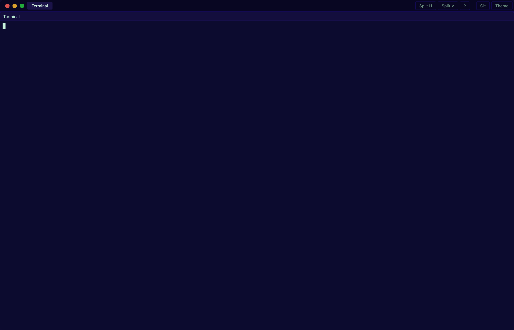
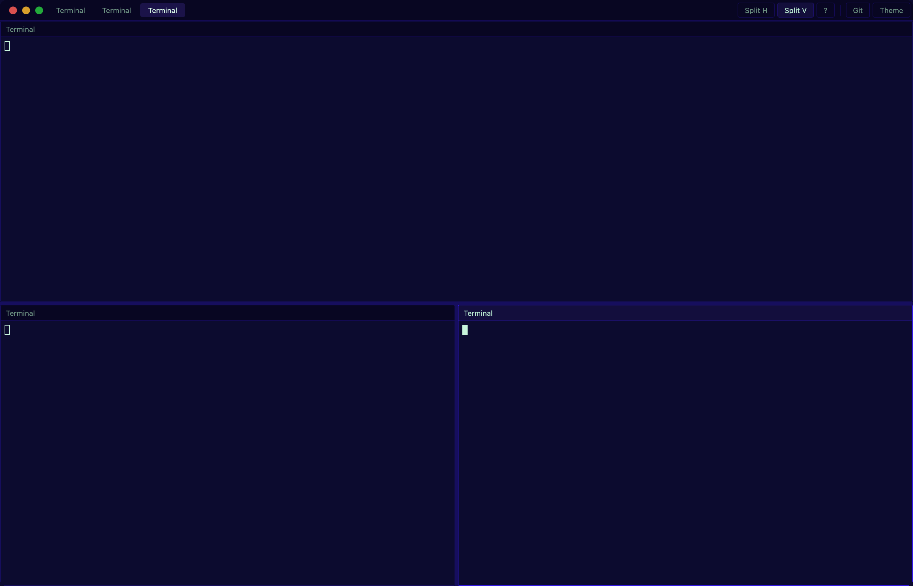
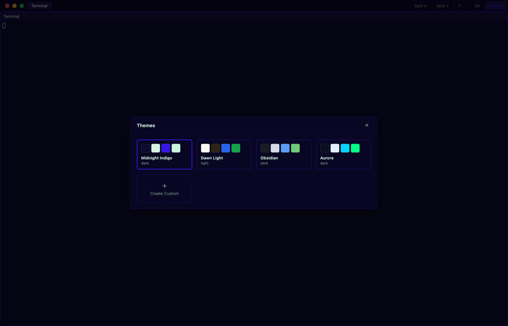
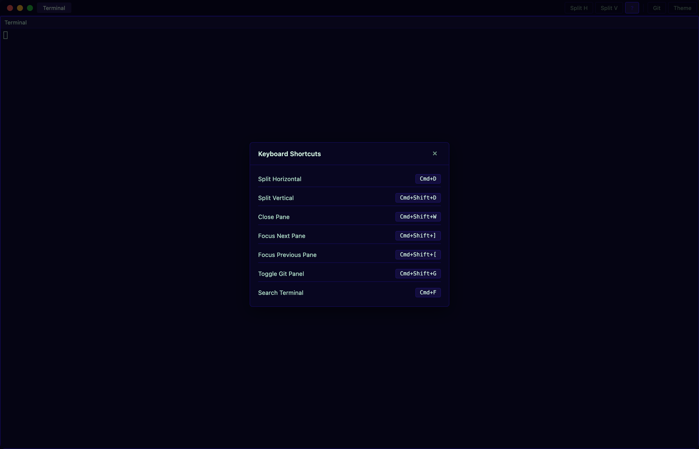

# Terminal+

A macOS terminal emulator built with [Tauri 2](https://tauri.app/) (Rust) and React/TypeScript. Features tiling pane layout, xterm.js terminal emulation, a built-in git panel with branch graph visualization, and full theme customization.



## Features

### Tiling Pane Layout

Split terminals horizontally and vertically into a resizable binary tree layout. Drag the split handles to resize, and navigate between panes with keyboard shortcuts.



### Built-in Git Panel

View your git history with an SVG branch graph, search commits, inspect file diffs, and see local changes — all without leaving the terminal.

<!-- TODO: Replace with screenshot taken from the native app (requires Tauri IPC) -->
<!--  -->

### Theme System

Four built-in themes (Midnight Indigo, Dawn Light, Obsidian, Aurora) plus a custom theme editor with full control over 50+ color variables.



### Keyboard Shortcuts

All core actions are accessible via keyboard shortcuts, viewable from the shortcuts overlay.



### Other Features

- **Custom titlebar** with native macOS traffic light buttons
- **Transparent window** with 20% background transparency
- **Tab management** for multiple terminal sessions
- **In-terminal search** with regex and case-sensitive modes
- **Shell integration** for zsh and bash (prompt, colors, plugin detection)
- **Drag-and-drop** file paths into terminal panes
- **Markdown preview** panel

## Prerequisites

- [Node.js](https://nodejs.org/) (v18+)
- [pnpm](https://pnpm.io/)
- [Rust](https://rustup.rs/) (stable toolchain)
- macOS (uses macOS-specific private APIs for window transparency)

## Getting Started

```bash
# Clone the repo
git clone git@github.com:StHaes/terminal-plus.git
cd terminal-plus

# Install frontend dependencies
pnpm install

# Run in development mode (starts Vite dev server + Tauri)
pnpm tauri dev
```

## Building for Production

```bash
# Build the app bundle (.app / .dmg)
pnpm tauri build
```

The output will be in `src-tauri/target/release/bundle/`. This produces:

- `Terminal+.app` — the macOS application
- `Terminal+.dmg` — disk image for distribution

### Frontend Only (without Tauri)

To work on just the frontend at `localhost:1420`:

```bash
pnpm dev
```

### Rust Backend Only

```bash
cd src-tauri
cargo check   # type-check
cargo build   # compile
```

## Tech Stack

| Layer    | Technology                          |
|----------|-------------------------------------|
| Backend  | Rust, Tauri 2, portable-pty         |
| Frontend | React 19, TypeScript, Vite          |
| Terminal | xterm.js                            |
| State    | Zustand + Immer                     |
| Styling  | CSS custom properties (no framework)|

## Project Structure

```
src/                    # React frontend
├── components/         # UI components (terminal, git, settings, layout)
├── lib/                # Pure logic (tiling tree, git graph layout, IPC wrappers)
├── stores/             # Zustand stores (tile, terminal, git, theme)
├── styles/             # CSS files with CSS custom property theming
└── types/              # TypeScript type definitions

src-tauri/              # Rust backend
├── src/
│   ├── pty/            # PTY session management, shell integration
│   └── git/            # Git CLI wrapper (log, diff, show)
└── tauri.conf.json     # Tauri app configuration
```

## License

MIT
